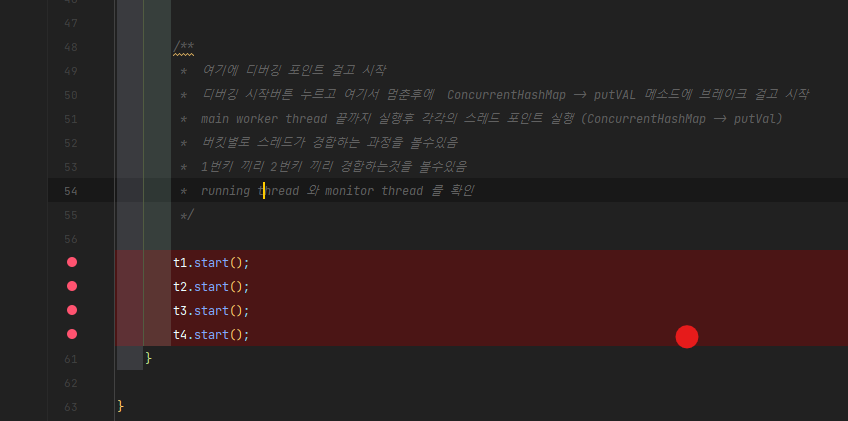
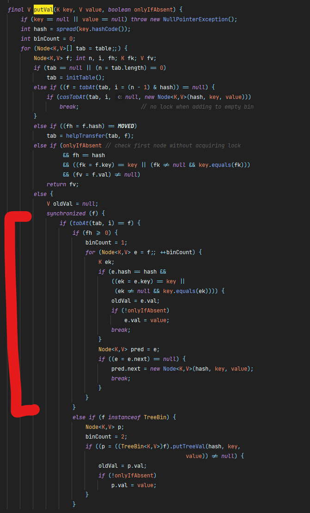
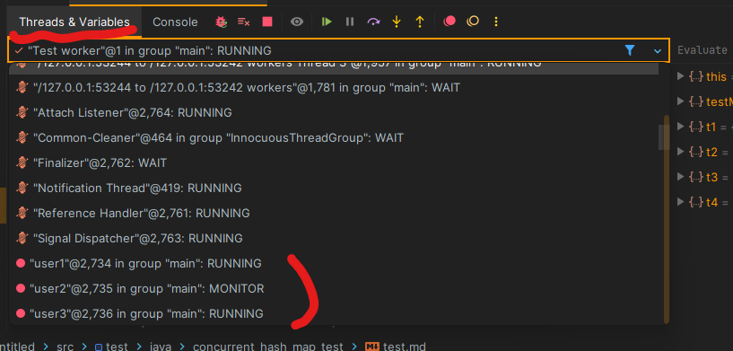

# 테스트 개요
- ConcurrentHashMap의 테스트를 진행한다.
- ConcurrentHashMap에 사용된 LockStriping 기술을 직접 눈으로 확인한다
- 일부러 락킹을 걸기위해서 출돌 나는 key를 map에 넣어두고 시작한다

# 실험방법
1. main worker thread가 끝까지 실행해야하지만 각각의 생성된 스레드가 종료되지 않도록 start 전에 브레이크 포인트를 건다
	- 
2. 디버그 버튼 클릭후 t1.start()에 디버깅 포인트에 걸려있을때 ConcurrentHashMap에 putVal method에 있는 synchronized 블럭에 브레이크 포인트를 건다
	- 
3. 메인 으로 돌아가 나머지 브레이크 포인터트를 넘겨서 MAIN 메서드 끝까지 실행시킨다
4. 그후 디버그 창에있는 Threads & Variables 탭을 클릭해 보고싶은 스레드를 클릭한뒤에 디버그를 실행하면 다음과 같이 스레드의 상태를 볼수있다.
	- 